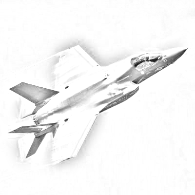

CFD Experiments
###############
:Author: Roie R. Black
:Date: April 6, 2020
:Email: roie.black@gmail.com
:Documentation: https://rblack42.github.io/CFDexperiments

|travis-build| |license|

This project hosts my experiments with Computational Fluid Dynamics on a
variety of machines using several common programming languages. The experiment
is based on code I developed in 1975 while working at the USAF Aerospace
Research Laboratory in Dayton, Ohio. The work was part of my Aerospace
Engineering PhD research project. Specifically, we will examining a simple
solution to the problem of axisymmetric flow over a projectile traveling at
high mach numbers. The numerical solution technique used reduces the
governing Navier-Stokes equations into a parabolized form, then solves those
equations using an  explicit finite-difference scheme based on MacCormack's
Predictor-Corrector method. 

The original code was developed in FORTRAN and ran on a CDC 6600 machine in
about 10 minutes. I even managed to get the code running on an early
Smith-Corona programmable desktop calculator, but the run-time was measured in
many hours.

I rewrote the code in Python in 2003 as part of a course in object-oriented
design at Texas State University while I was working on a Masters degree in
Computer Science. That project added a graphical display so results could be
seen visually. The result was interesting and the new code produced solutions
in under ten seconds. That was quite surprising, and demonstrates how far
modern computers have evolved. The Python code served as a prototype for a
simple tool students could use to explore the world of CFD.

The experiments in this project will cast this solution in three languages:
Python, C++, and Go. The resulting code will be run on a variety of machines
including a modern 8-core Intel chip in my Macbook Pro, a Raspberry Pi, a
Cluster of eight Raspberry Pi machines, and on an array of machines hosted on
Digital Ocean. In an ideal world, I may try to get the code running on a modern
supercomputer.

The project uses a visual front end written in Python, a language many students
learn in their first semesters in school. The computational engines will be
written in modern high-performance languages. We will explore new tools for
generating the needed code nd conduct experiments aimed at understanding how to
solve CFD problems on modern computer systems.

In all of this work, students will be able to follow along as all of the code
is developed. The project uses Jupyter Notebooks, which are designed to be run
on the students machines. We will also show how to set up projects that can be
run on remote systems and viewed locally on any laptop or tablet.

The target reader of this material is an engineering student with at least one
semester of programming experience, preferably in Python. All code will be
explained in enough detail that students will be able to set up their local
machines and run all experiments.

..  note::

    Image created from photo found on https://twitter.com/LockheedMartin. It
    was converted into this sketch using ImageMagik using this command: 
    
    * convert f35.jpg \( -clone 0 -negate -blur 0x12 \) -compose colordodge
    -composite \ -modulate 90,0,90 -auto-level f35_sketch.png

..  |travis-build| image:: https://travis-ci.org/rblack42/CFDexperiments.svg?branch=master
    :alt: Build badge from Travis-CI

..  |license| image:: https://img.shields.io/badge/License-BSD%203--Clause-blue.svg
    :alt: BSD 3-Clause License

